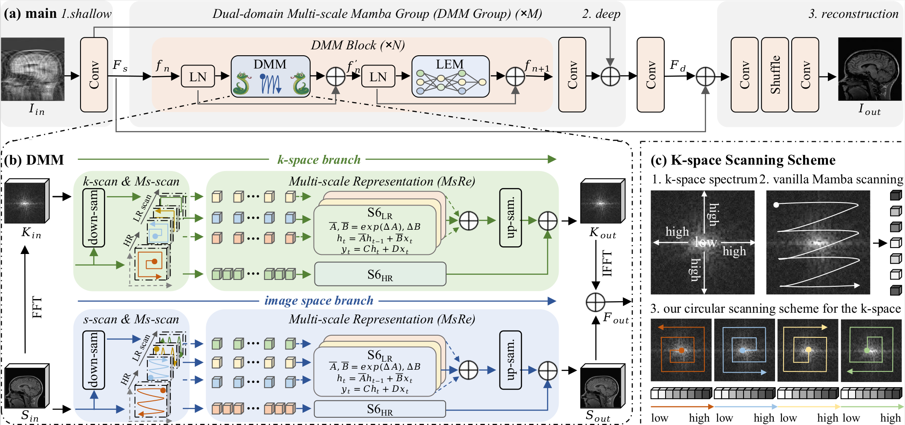
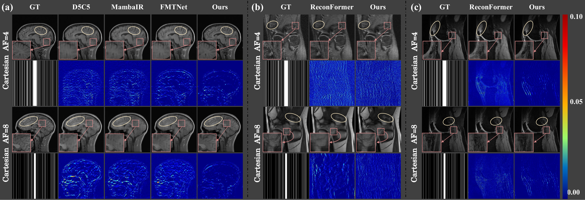
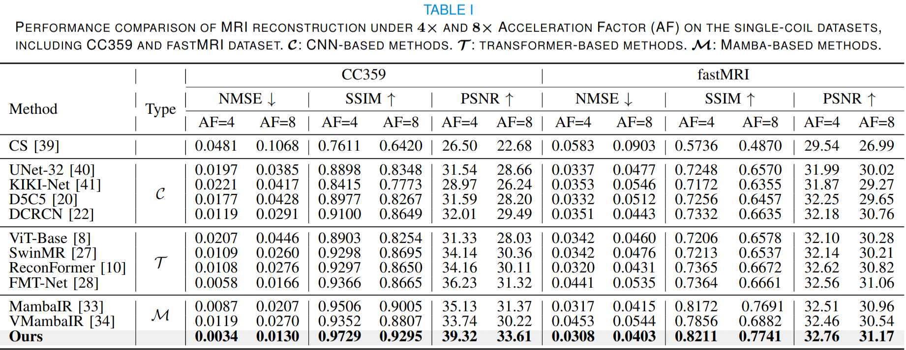

# [UnderReview] DM-Mamba: Dual-domain Multi-scale Mamba for MRI reconstruction [](https://arxiv.org/abs/2501.08163)
This paper pioneers exploring Mamba, a new paradigm for long-range dependency modeling with linear complexity, for efficient and effective MRI reconstruction. 

## News

* **If you find this work helpful, please give us a :star2: to receive the updation !**
* **` Jan. 11th, 2025`:** DM-Mamba is underReview.
* **We are sorting the code** 🔥🔥🔥

## Overview

<p align="middle">

</p>

The accelerated MRI reconstruction poses a challenging ill-posed inverse problem due to the significant undersampling in k-space. Deep neural networks, such as CNNs and ViT, have shown substantial performance improvements for this task while encountering the dilemma between global receptive fields and efficient computation. To this end, this paper pioneers exploring Mamba, a new paradigm for long-range dependency modeling with linear complexity, for efficient and effective MRI reconstruction. However, directly applying Mamba to MRI reconstruction faces three significant issues: (1) Mamba's row-wise and column-wise scanning disrupts k-space's unique spectrum, leaving its potential in k-space learning unexplored. (2) Existing Mamba methods unfold feature maps with multiple lengthy scanning paths, leading to long-range forgetting and high computational burden. (3) Mamba struggles with spatially-varying contents, resulting in limited diversity of local representations. To address these, we propose a dual-domain multi-scale Mamba for MRI reconstruction from the following perspectives: (1) We pioneer vision Mamba in k-space learning. A circular scanning is customized for spectrum unfolding, benefiting the global modeling of k-space. (2) We propose a multi-scale Mamba with an efficient scanning strategy in both image and k-space domains. It mitigates long-range forgetting and achieves a better trade-off between efficiency and performance. (3) We develop a local diversity enhancement module to improve the spatially-varying representation of Mamba. Extensive experiments are conducted on three public datasets for MRI reconstruction under various undersampling patterns. Comprehensive results demonstrate that our method significantly outperforms state-of-the-art methods with lower computational cost.

## Data Preparation

Prepare the dataset in the following structure for easy use of the code.The provided data loaders is ready for this this format and you may change it as your need.

```bash


                   |-- 
                   |                       
                   |                |--xxx.h5  
Dataset Folder-----|      |--train--|...
                   |      |         |...
                   |      |                  
                   |      |         
                   |--PD -|
                          |
                          |         |--xxx.h5 
                          |-- val --|...  
                                    |...
 ```

### Links for downloading the public datasets:

1) CC359 Dataset - <a href="https://sites.google.com/view/calgary-campinas-dataset/download"> Link </a>
1) fastMRI Dataset - <a href="https://fastmri.med.nyu.edu/"> Link </a>
2) SKMTEA Dataset - <a href="https://stanfordaimi.azurewebsites.net/datasets/4aaeafb9-c6e6-4e3c-9188-3aaaf0e0a9e7"> Link </a>


## Requirement

Ubuntu 20.04\
CUDA 11.7\
Python 3.9\
PyTorch 2.0.1 + cu117

## Main Results

#### 1. Qualitative comparison.

<p align="middle">

</p>

#### 2. Comparison with State-of-the-arts
<p align="middle">

</p>

<!-- ## Citation 
Please cite our work if you find it helpful to your reseach. :two_hearts:
```bash
@article{meng2024boosting,
  title={Boosting ViT-based MRI Reconstruction from the Perspectives of Frequency Modulation, Spatial Purification, and Scale Diversification},
  author={Meng, Yucong and Yang, Zhiwei and Shi, Yonghong and Song, Zhijian},
  journal={arXiv preprint arXiv:2412.10776},
  year={2024}
} -->
```
If you have any questions, please feel free to contact the author by ycmeng21@m.fudan.edu.cn.

## Acknowledgement
This repo is built upon [fastMRI](https://github.com/facebookresearch/fastMRI), [ReconFormer](https://github.com/guopengf/ReconFormer), and [MambaIR] (https://github.com/csguoh/MambaIR). Many thanks to their brilliant works!!!
